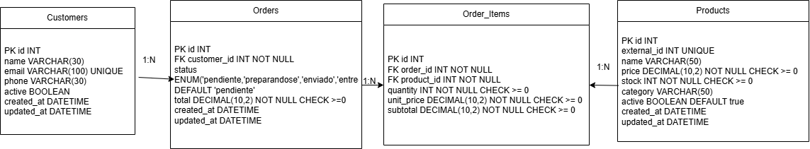

# BD Modelo de datos

## Tabla: customers

- id INT PK NOT NULL AUTO_INCREMENT
- name VARCHAR(30) NOT NULL
- email VARCHAR(100) NOT NULL UNIQUE
- phone VARCHAR(30)
- active BOOLEAN DEFAULT true
- created_at DATETIME
- updated_at DATETIME

## Tabla: products

- id INT PK NOT NULL AUTO_INCREMENT
- external_id INT UNIQUE
- name VARCHAR(50) NOT NULL
- price DECIMAL(10,2) NOT NULL CHECK >= 0
- stock INT NOT NULL CHECK >= 0
- category VARCHAR(50)
- active BOOLEAN DEFAULT true
- created_at DATETIME
- updated_at DATETIME

## Tabla: orders

- id INT PK NOT NULL AUTO_INCREMENT
- customer_id INT FK NOT NULL -> customers.id
- status ENUM('pendiente', 'preparandose', 'enviado', 'entregado') DEFAULT 'pendiente'
- total DECIMAL(10,2) NOT NULL CHECK >= 0
- created_at DATETIME
- updated_at DATETIME

## Tabla: order_items

- id INT PK NOT NULL AUTO_INCREMENT
- order_id INT FK NOT NULL -> orders.id
- product_id INT FK NOT NULL -> products.id
- quantity INT NOT NULL CHECK > 0
- unit_price DECIMAL(10,2) NOT NULL CHECK >= 0
- subtotal DECIMAL(10,2) NOT NULL CHECK >= 0

## Relaciones

- customers 1:N orders
- orders 1:N order_items
- products 1:N order_items

## Diagrama entidad-relación

## Explicación de relaciones

Un cliente puede tener muchos pedidos, pero cada pedido pertenece a un único cliente.

Un pedido puede tener muchas líneas de pedido, representadas mediante `order_items`.

Un producto puede aparecer en muchas líneas de pedido, porque el mismo producto puede venderse en pedidos diferentes.

La tabla `order_items` funciona como tabla intermedia entre `orders` y `products`, y además guarda información propia de cada línea, como la cantidad, el precio unitario y el subtotal.
